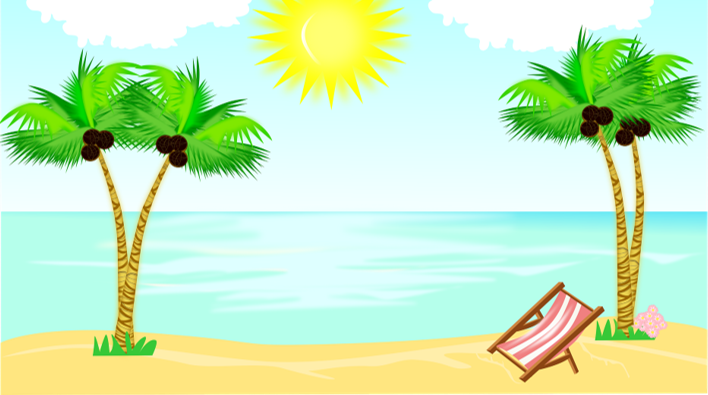

# Rock Paper Scissors by the Sea

## Site Overview

This game was developed as part of my second Milestone project with [Code Institute](https://github.com/Code-Institute-Org). It consists of an interactive front-end site built using HTML, CSS and JavaScript.

Rock Paper Sicssors by the Sea is a fun game of rock paper scissors developed for children. The game looks to transmit seaside and holiday vibes and has a fun pirate theme going on.

The goal of the game is for the children to defeat the mighty pirate Redbeard on a game of rock paper scissors. The game was developed with defensive design in mind and directs the user with a clear set of instructions. The game counts with a "Game Rules" button leading, on click, to a modal box pop up displaying the objective and rules of the game. 

The site also validates the data the user inputs (choice of rock, paper, or scissors) and gives feedback to the user where needed. Feedback is provided for each round with text ("You win", "You lose", "It's a draw") and the leaderboard is also updated after each round increasing the score of the child or Redbear depending on who wins the round. Feedback is also provided at the end of the game via an end of game modal box which pops up announcing the winner whenever the children or Redbeard reach a total score of 3 points on the leaderboard.

The game responds to the users' actions, allowing children to actively engage with data and alter the way the site displays the information in response to their actions.

## Target audience

This game was developed for young children, hence the choice of a fun and child friendly pirate theme as this is one of the most classic childhood themes for preschool/school activities and arts and crafts as well as children's parties.

The choice of images across the site is reflective of the target audience and includes fun Clip Art png images like the five mateys and Redbeard png on the leaderboard, the parrot and the rock-paper-scissors trio with googly eyes on the main title and the pirate boat on the game rules modal. 

The font chosen for the site is the Chelsea market google font as it conveys an appealing look and feel for children and is fun and informal. Chelsea market also blends in well with the site beachy background and the seaside theme.

The vocabulary used across the site addresses the users in a direct and simple way and is child oriented including fun pirate expressions like “matey” or “shiver me timbers”. 

Finally, different emojis are used in the game rules modal and in the round result section as this is a feature generally liked by children.

The colour palette is bold, bright, and candid including colours like orange, dark blue and white in buttons and fonts. The yellow sun and the light blue sea and sky in the background take a dominant place in the site colour representation.

## Features

### Background

-	The background is a Clip Art png image of a beach scene which goes well with the seaside theme.
-	The background fills the screen and the game is fully visible over the background at a glance without the need to scroll up or down as scrolling would make the game less intuitive and more difficult to interact with by young children.
- The background is styled with a fixed background attachment and a centered position for optimal display in all screen sizes.

### Main header

-	The main header is Rock Paper Scissors by the Sea to again reflect on the seaside theme. 

-	The tile is split in two lines for better readability and is also framed by two fun png images to either side: a friendly rock, paper, scissors trio with googly eyes and a colourful parrot.

-	The position of the title is at the top of the screen and in most screen sizes it will be position above the bright yellow sun in the background image giving it a nice warm contrast and feel.

### Game rules button

-	The games rules button is position between the title and the rock, paper and scissors buttons. On click, this button will open up a modal box containing a set of rules to play the game.

-	The button is blue with an orange border and white fonts. These colours change on hover to reveal a white button with a blue border and orange fonts.

### Rules modal

-	The rules modal pops up whenever users click on the game rules button. 
-	The modal lists the rules of the game and also includes a png image of four children aboard a pirate boat, a fun sunglasses emoji and a close button.
-	The close button will close the rules modal on click and follows the same colour pattern as the game rules button. 

### Choice buttons: Rock, Paper, Scissors

-	This section contains a header: “Rock, Paper, Scissors…now You Show!” as a call to action to incite users to choose one of the below buttons.

-	Each of the three buttons shows a png image of a hand doing the actions of rock, paper and scissors.

-	The buttons have an orange border which turns blue on hover to highlight the button the user is about to press.

### Round result

-	The round result section is placed just under the choice buttons and returns the user choice as well as Redbeard’s choice of rock, paper, or scissors.

-	The result of each round is also displayed (“You win!”, “You lose!”, or “It’s a draw!”) followed by a grinning, cold sweat or rolling eyes emoji, depending on who wins the round.

### Leaderboard

-	The leader board returns the total score of each player adding up the score of consecutive rounds up to a total of 3. (Whenever the user or Redbeard reaches 3 points, an end of game modal will pop up).

-	The board is built on a grid format with one column showing the image of five children with the user’s score under it, and a column showing an image of Redbeard with his total score just below.

### End of game modal

-	The end of game modal pops up whenever the user or Redbeard reaches 3 points.

-	The modal will announce who is the winner and includes a png image of a pirate boat next to a treasure chest and a bottle containing a treasure map. 

-	The modal also includes a play again button which will close the modal on click and will return to the main game screen where all the scores will be reset for a new game. This button follows the same colour pattern as the game rules button and the close button in the rules modal.

### Features left to implement

- Add a music button to main page with a seaside themed music to listent to on click while playing the game.

## Testing 
- I used Edge, Chrome and Firefox desktop browsers to ensure cross-compatibility.
- I used DevTools to simulate different smaller screen sizes down to 320px in width including Android tablets and mobile phones and iOS devices.
- I tested in several personal devices and also asked my mentor, friends and relatives to test the site on Opera and iOS and no errors were reported.
- I asked my network to test the functionality of the game on their devices, to click every button and check every modal box and to also check for typos, etc. No errors were reported.
- Finally, as detailed below, I used several validator tools like Nu HTML checker, W3C CSS validator tool, and JSHint to check and no warnings are being flagged at the time of this submission.

### Issues and fixes

1. Intended outcome: Follow HTML5 best practices with regards to use of Headers. 
   - Issue: The idea was to split the main h1 title in two separate lines for added readability and better display. I first used two h1 with the same main-header class but as pointed out by my mentor best practices recommend to only have one single h1 for the page.
   - Fix: I used one single h1 for the main title and split it in two separate lines using a break tag.
2. Intended outcome: Pass the HTML validation with 3W specifically for using id to target one single element and class with several elements. 
   - Issue: As flagged by the validator I had used the same id with two different elements (the two original h1 headers).
   - Fix: this is now irrelevant as I ended up merging the two h1 into one (as detailed above) but before merging the two h1 I changed the id "main-header" with a class in order to pass the validation.
3. Intended outcome: Adequate background display in all screen sizes. 
   - Issue: The game has a main background clip art image with a seaside theme. I was not sure whether to choose a "fixed" or "cover" background-attachment in style.css as ideally I wanted the sun at the top of the image and the sand at the very bottom to both display in all screen sizes. This proved to be impossible as I switched from a "fixed" to a "cover" attachment several times with different commits. In some formats the sun was showing but not the sand, in other formats just the sea in the middle was showing.
   - Fix: I considered changing the background image and tested other images with different commits but ultimately I decided to keep the original background image as it was all in all more suitable for the game. I cropped the top of the original background image with an image editor in an effort to better centre the image vertically in most screens sizes. I finally settled for a fixed background-attachment. There is no size that fits all but I believe that the choices I made are a good compromise:

   

4. Intended outcome: Creating three functional buttons with icons representing either rock, paper or scissors. 
   - Issue: I first tried to use an input type inside each button and to assign an icon and styling inside this tag. However, the buttons were not functional/clickable this way.
   - Fix: I deciced to just leave the button tag in the HTML file and to remove the input type. I then styled the buttons in the CSS file with the help of background images. This resulted in perfectly functional buttons.
5. Intended outcome: Leaderboard well centered on screen. 
   - Issue: At first the CSS grid table used for the leaderboard wasn't centered.
   - Fix: I used the article by Scott Grannneman referenced below where he recommends to center a table by setting the margins, like this:  

   

6. Intended outcome: Correct width/hight ratio for all png images. 
   - Issue: When adapting size of png images to better fit different screen sizes, I accidentally altered some of the aspect ratios causing the images to look slightly distorted.
   - Fix: I set all of the images to the correct aspect ratio by just setting the width to auto as I wanted to preserve the height in pixels that I had assigned.   
7. Intended outcome: Create a JS function to generate the computer choice of rock, paper or scissors. 
   - Issue: I first used an array composed of ['rock', 'paper', 'scissors'] to use this with a Math.Random function but this didn't give me the expected random choice result and 'rock' wasn't picked. I do not fully understand why 'rock' wasn't piced but I ended up having to add an ackward ||'rock' in the code to ensure a random computer choice where 'rock' would be also picked. However, this didn't look right and I decided to change this on my mentor's advice. 
   - Fix: I deleted the constant choices=['rock', 'paper', 'scissors'] and replaced with if statements linked to anyNumber from 1 to 3 in order to generate the computer choice. This fix brings simplicity and better randomness of computer choice. The JS code is now longer than before but it is fully functional.
8. Intended outcome: Avoid targeting all buttons when declaring the constant differentChoices with a querySelectorAll.
   - Issue: This practice could create conflicts with other buttons that I didn't want to target (like the game rules button, the close button or the play again button). Instead, target only the choice buttons (rock, paper, scissors)
   - Fix: Give rock paper scissors a 'choice' class in order to target that class with querySelectorAll as per w3schools tutorial.
   
   

9. Intended outcome: Good JS code functionality. 
   - Issue: As I am learning how to code in JavaScript I occasionally make mistakes in the way I write the code and end up finding out about my mistakes because the code doesn't behave as expected. For example, I made a mistake when writing the event listener that targets the three different choices of rock, paper, or scissors on click.
   - Fix: I reviewed the documentation on the W3 schools website and changed the code.

   

10. Intended outcome: Increased Accessibility score on Lighthouse. 
    - When testing with Lighthouse I realised that the site was only achieving an accessibility score of 89. The reason was that the three choice buttons (rock, paper and scissors buttons) did not have an accessibile name. When a button doesn't have an accessible name, screen readers announce it as "button", making it unusable for users who rely on screen readers.
    - Fix: I added an aria-label to each one of the three choice buttons and the accessibility score is now 100.

### Validator testing
- HTML Validator: https://validator.w3.org/nu/
  - Issue found: The validator flagged that the third h3 tag in the current-game-display div was empty of content. The reason why this h3 tag was empty of content was that it simply announces the winner of the round and displays different JS content depending on who wins each round (i.e. "You win", "You lose", "It's a draw").
  - Fix: I simply added three suspension points inside the h3 html tag as placeholder which also adds to the idea of suspense on who is going to win the round.
Game is now fully validated with no HTML errors.

- CSS Validator: https://jigsaw.w3.org/css-validator/
  - The CSS code was validated as CSS Level3 +SVG with no errors found.

- JavaScrip Validator: https://jshint.com/
  - Issue found: missing semi-colons at the end of several lines.
  - Fix: semi-colons added
JS code shows no warnings at the time of this submission. As highlited by the JS linter, there are 12 functions in this file. The function with the largest signature takes 1 argument, while the median is 0. The largest function has 21 statements in it, while the median is 2. The most complex function has a cyclomatic complexity value of 14 while the median is 1.

### Contrast testing
- WCAG Color contrast checker: The score reported was AAA as seen in screenshot below:

### Performance, Accessibility, Best practices and SEO testing with Lighthouse
Test conditions:
- All lighthouse tests were carried out in incognito mode to avoid interference from browser extensions.
- All tests were run for both mobile and desktop.
- The scores shown are the final scores after fixing the accessibility issue mentioned in the "Issues and Fixes" section above.

Lighthouse Scores for Desktop:

  
Lighthouse Scores for Mobile:

## Deployment
This website was deployed using GitHub Pages following the below procedure:

- From the project's repository, click on the Settings tab located in the top navigation bar.
- From the left-hand menu, select the Pages tab.
- Under the Source section, select the Main branch from the drop-down menu and click Save.
- A message will be displayed to indicate a successful deployment to GitHub pages and provide the live link.
- You can find the live site via the following URL: [Rock Paper Scissors by the Sea](https://garcia-sonia.github.io/Rock-Paper-Scissors/)

## Credits 

### Technical Reference

Firstly I would like to thank my mentor Richard Wells and the Community at Code Institute for their guidance and support throughout this JavaScrip Project Portfolio2.

I also got inspiration from Ania Kubów's video [3 ways to code Rock Paper Scissors in JavaScript](https://www.youtube.com/watch?v=RwFeg0cEZvQ) and used this as a starting point although overall my JS code varies significantly (for example using a querySelectorAll calling a class instead of all buttons and incorporating a win() or lose() function in every if statement in the function calculating the result). My JS code also contains further features (like a leader board and a game rules button) and further event listeners and functions (like the ones operating the rules and end of game modals).

Otherwise, I relied mainly upon content from W3schools and CI LMS tutorials for this project. 

CSS Grid Layout Module
https://www.w3schools.com/css/css_grid.asp

How to position a background image
https://www.w3schools.com/cssref/pr_background-position.asp

HTML DOM Document querySelectorAll()
https://www.w3schools.com/jsref/met_document_queryselectorall.asp

JavaScript Arrow Function
https://www.w3schools.com/js/js_arrow_function.asp

HTML DOM Element addEventListener()
https://www.w3schools.com/jsref/met_element_addeventlistener.asp

JavaScript Math.floor()
https://www.w3schools.com/jsref/jsref_floor.asp

JavaScript if else and else if
https://www.w3schools.com/js/js_if_else.asp

How TO - CSS/JS Modal
https://www.w3schools.com/howto/howto_css_modals.asp

Finally, I used the following references to help fix some of the bugs described in previous sections:

Center a table with CSS by Scott Grannneman
https://granneman.com/webdev/coding/css/centertables

aria-label by Aditus
https://www.aditus.io/aria/aria-label/

### Content Inspiration

All content in the game "Rock Papers Scissors by the Sea" was written by myself.
The Seaside Pirate theme was inspired by my daughters' ideas as so was the choice of Emojis and Clip art pgn images across the site.

### Media
Background image: Image by London Calling from Pixabay 
https://pixabay.com/illustrations/summer-clipart-nature-storytelling-5350229/
    
Main title parrot image: clipartmax
https://www.google.com/url?sa=i&url=https%3A%2F%2Fwww.clipartmax.com%2Fmiddle%2Fm2i8K9G6i8i8b1Z5_parrot-talking-bird-clip-art-parrot-clipart%2F&psig=AOvVaw3wSHrWUGVbukQMN7DqfOBz&ust=1648189991827000&source=images&cd=vfe&ved=0CAsQjRxqFwoTCLDPpKmQ3vYCFQAAAAAdAAAAABAD

Main title rock paper scissors image:
https://www.google.com/url?sa=i&url=https%3A%2F%2Fwww.clipartmax.com%2Fmiddle%2Fm2H7N4b1b1Z5N4K9_rock-paper-scissors-rock-paper-scissors%2F&psig=AOvVaw2DAfZw6DqAT_NiOV9T8t9P&ust=1648190236347000&source=images&cd=vfe&ved=0CAsQjRxqFwoTCOjq_KSR3vYCFQAAAAAdAAAAABAD

Game Rules modal image: png wing
https://www.pngwing.com/en/free-png-puqtw

Five Mateys image in Leaderboard: Flyclipart
https://flyclipart.com/st-michael-all-angels-lusitania-clipart-12621

Redbeard image in Leaderboard: Flyclipart
https://flyclipart.com/free-pirate-clip-art-look-at-pirate-clip-art-clip-art-images-pirate-clipart-153912

Rock button image:
https://pixabay.com/vectors/rock-paper-scissors-rock-hand-296854/

Paper button image:
https://pixabay.com/vectors/rock-paper-scissors-paper-hand-296855/

Scissors button image:
https://pixabay.com/vectors/rock-paper-scissors-scissors-hand-296853/

End of game modal image:
https://www.maxpixel.net/Gold-Ship-Ocean-Pirate-Treasure-Pirate-Ship-3946618

### Other tools and resources

Fonts were imported from Google fonts
Website was tested with Chrome DevTools and Lighthouse
JS compliance was tested using [JSHint](https://jshint.com/)
CSS was validated with [The W3C CSS Validation Service](https://jigsaw.w3.org/css-validator/validator)
HTML was validated with [Nu Html Checker](https://validator.w3.org/nu/#textarea)
Mockups to show Responsive Design were taken using [Am I Responsive](http://ami.responsivedesign.is/)
